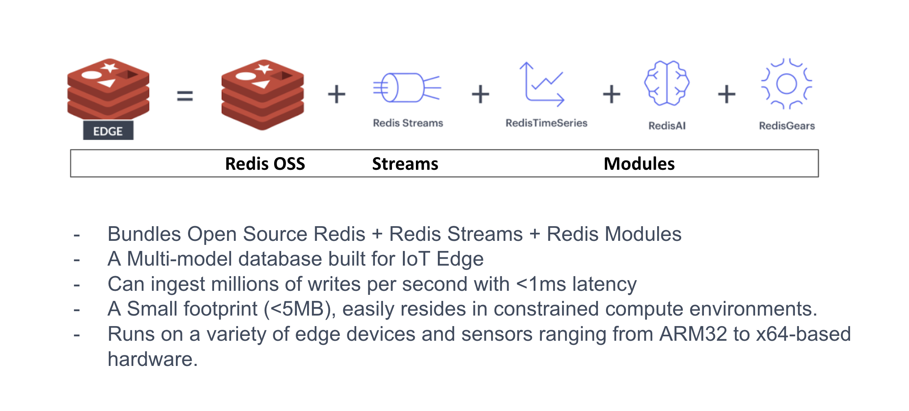
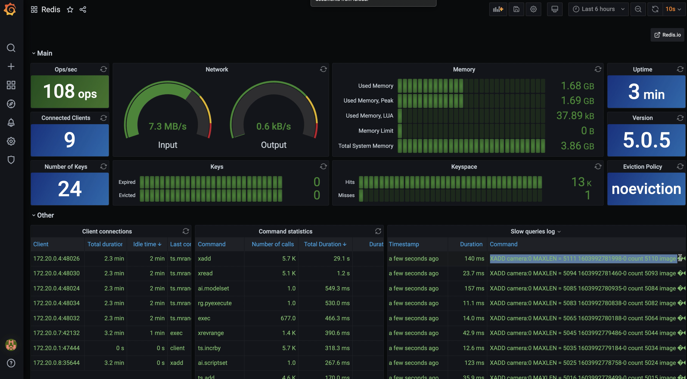
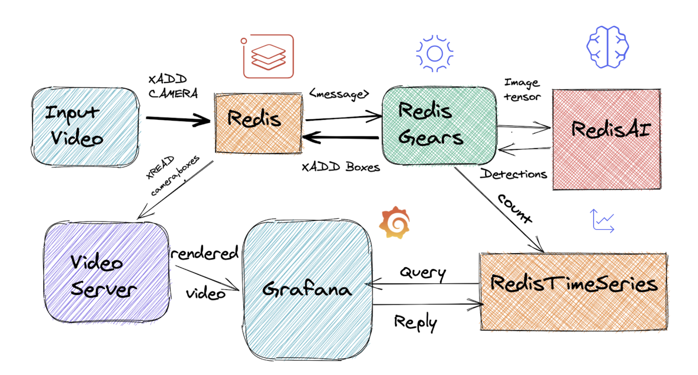

# Dockerized RedisEdge Real-time Video Analytics + Redis Data Source Plugin for Grafana 
Extending https://github.com/RedisGears/EdgeRealtimeVideoAnalytics

An example of using Redis Streams, RedisGears, RedisAI, and RedisTimeSeries for Real-time Video Analytics (i.e. counting people).

## Overview

This project demonstrates a possible deployment of the RedisEdge stack that provides real-time analytics of video streams.

Also, this conists of Redis Data Source Plugin for Grafana

The following diagram depicts the flows between the system's parts.

The process is a pipeline of operations that go as follows:
1. A video stream producer adds a captured frame to a Redis Stream.
2. The new frame triggers the execution of a RedisGear that:
    1. Downsamples the frame rate of the input stream, if needed.
    2. Prepares the input frame to the model's requirements.
    3. Calls RedisAI to execute an object recognition model on the frame.
    4. Stores the model's outputs (i.e. people counted and their whereabouts inside the frame) in Redis Stream and TimeSeries.
3. A video web server renders the final image based on real-time data from Redis' Streams.
4. Time series are exported from Redis to Prometheus, enabling visualization with Grafana's dashboards.

### The RedisEdge Stack

The RedisEdge stack consists of the latest Redis stable release and select RedisLabs modules intended to be used in Edge computing. For more information refer to [RedisEdge](https://github.com/RedisLabs/redis-edge-docker).

### YOLO

You Look Only Once, or YOLO for shorts ([good overview](https://leonardoaraujosantos.gitbooks.io/artificial-inteligence/content/single-shot-detectors/yolo.html)), is an object detection neural network. This project uses the "tiny" YOLOv3 model.

